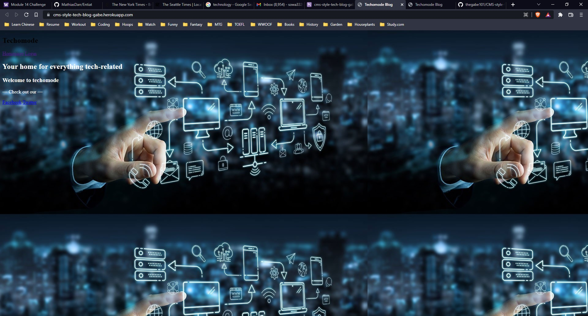
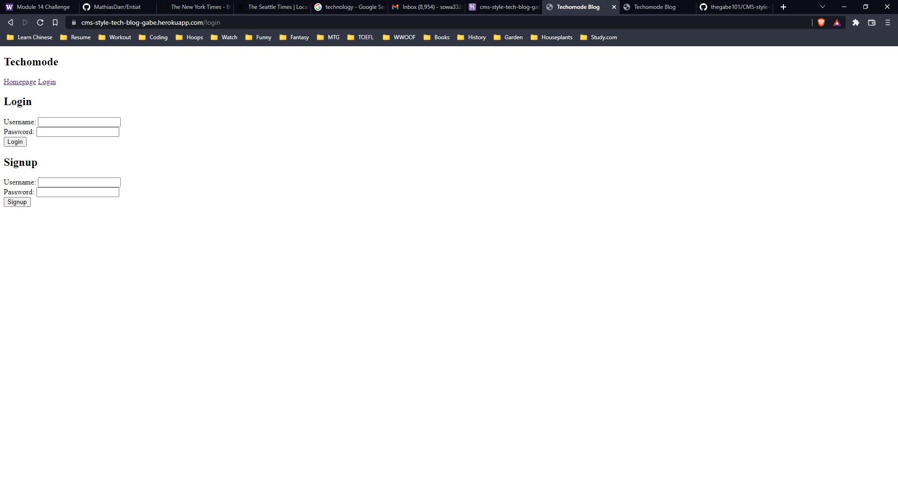
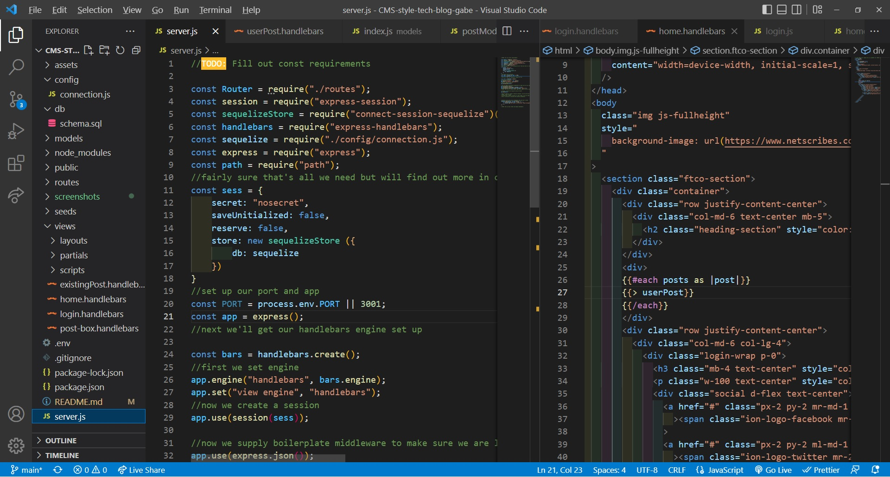
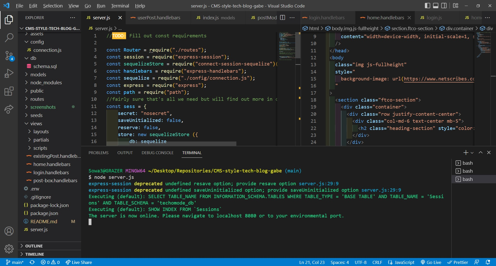

# CMS-tech-style-blog

## Table of Contents

## Heroku https://cms-style-tech-blog-gabe.herokuapp.com/

- [Description](#description)
- [Installation](#installation)
- [Usage](#Usage)
- [Bugs](#Bugs)
- [Screenshots](#screenshots)
- [Credits](#credits)

## Description

This project involved creating a fully functioning, session enabled website with a user database and user object info. The website would display posts and comments upon posts made by a logged in user.

- The motivation for building this project was learning to integrate live databases with user login credentials and npms like bcrypt, sequelize, and connection-session-sequelize. While we have done a significant amount of database work on localhosts and apis thus far, this was a new step toward enabling a website to be live and responsive to individual unique user ids stored in MySQL. Handlebars is an additional tool introduced here that will no doubt serve a primary tool in future work.
- I built this project largely in order to continue to get practice with the skills we are working on in class. This project was extremely wide in scope and unfortunately I do not have the time to finish it at the moment. My goal here was to construct the skeleton as a learning experience in how a website built from scratch will be built, look, and function.
- In theory, this project would render a fully useable website that would enable forum-style discussion via commenting by users in "post" form. Posts would be able to be commented on by other users and all data would be unique to individual, logged in users.
- This project was wide in scope and I realized rather quickly that given life circumstances and the impending project 2 I would be unable to finish it. I tried to replicate the experience of starting such a website from scratch and think I have learned the steps required with reasonable accuracy. I ran out of time before I could reach CRUD and routing.

## Installation

- Running this node is similar to many others we have covered. The user should be able to run server.js and navigate to the localhost and login with a session (username and password). This app can also be navigated to using Heroku, to which a link has been supplied.

## Usage

- In order to utilize this project, the user should expect to work from within the command line in a node. After opening an integrated terminal within the OOP Team Generator folder, they can run 'node index.js' and begin inquirer prompts. The user follows a series of prompts that will assume they work at a company with several roles (including asking their own role, which will auto fill as employee). Once the user is finished entering information about themselves and their coworkers, an html file named 'yourTeam.html' will be generated. This html file will display parameters for each employee input by the user in the command line prompt.

## Bugs

- This project is not fully functioning as the code is not complete. Currently, functionality is limited to rendering the homepage and the login page when the link is clicked.

## Screenshots

- 
- 
- 
- 

## Credits

- This project could not have been completed without the hardwork and excellent advice of my educators at UW Fullstack and tutor, Jacob Carver.
